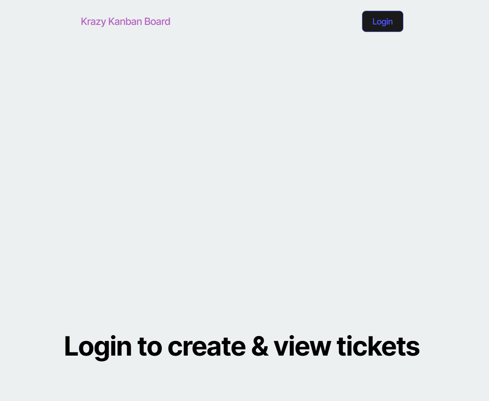
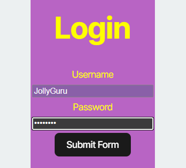
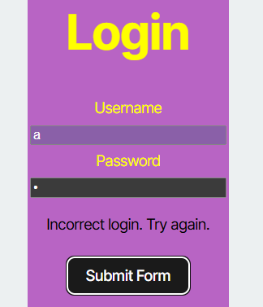
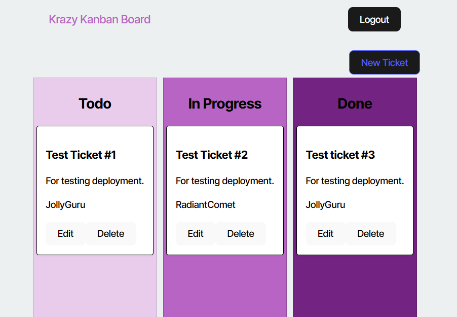

# Kanban Board
## Description:
Web application that allows a user to securely log in and alter a kanban board and its tickets.

This application was created to practice the implementation of JSON Web Token (JWT) authentication as well as the implementation of other login functionalities.

## Table of Contents:
- [Technologies](#technologies)
- [Installation](#installation)
- [Usage](#usage)
- [Questions](#questions)

## Technologies:
- TypeScript
- React
- [Render](https://render.com/)
- Express
- PostgreSQL
- Node

## Installation:
View the deployed application at <https://kanban-board-n693.onrender.com/>.

## Usage:
- Click the login button on the home page.  

- Enter valid credentials (any of the seeded credentials).  

- Invalid login attempts will result in a prompt to try again.  

- Edit, delete, and create tickets from the Kanban board.  

- End your session by clicking 'Logout'.
- Note: if tokens expire, the user will be logged out and redirected to the home page.

## Questions:
Contact me via github: [kayla-e774](https://github.com/kayla-e774)  
Or email me at: <kengelstad16@gmail.com>